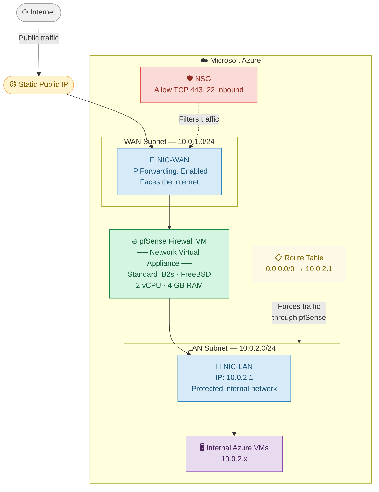

# 🔥 pfSense as a Network Virtual Appliance (NVA) on Azure

> A complete step-by-step guide to deploying pfSense as a firewall/NVA on Microsoft Azure using PowerShell — covering both the **Azure Marketplace** method and a **custom Hyper-V VHD** method, with line-by-line command explanations.

[← Back to Firewalls](README.md) · [← Back to Main Index](../README.md)

---

## 📋 Table of Contents

- [Prerequisites](#prerequisites)
- [Architecture Overview](#architecture-overview)
- [Part 1 — Azure PowerShell Setup](#part-1--azure-powershell-setup)
- [Part 2 — Networking Foundation](#part-2--networking-foundation)
- [Part 3 — Network Security Group (NSG)](#part-3--network-security-group-nsg)
- [Part 4 — Public IP and NICs](#part-4--public-ip-and-nics)
- [Part 5A — Deploy pfSense (Azure Marketplace)](#part-5a--deploy-pfsense-azure-marketplace)
- [Part 5B — Deploy pfSense (Custom Hyper-V VHD)](#part-5b--deploy-pfsense-custom-hyper-v-vhd)
- [Part 6 — Initial Console Setup](#part-6--initial-console-setup-serial-console)
- [Part 7 — Azure Route Tables](#part-7--azure-route-tables)
- [Part 8 — Access the Web GUI](#part-8--access-the-pfsense-web-gui)
- [Part 9 — Firewall Rules](#part-9--firewall-rules-in-pfsense)
- [Troubleshooting](#troubleshooting)
- [Clean Up Resources](#clean-up-resources)

---

## Prerequisites

| Requirement | Details |
|---|---|
| Azure Subscription | Active subscription with Contributor or Owner rights |
| PowerShell 7+ | Installed on your local machine |
| Az PowerShell Module | Installed — covered in Part 1 |
| Hyper-V *(optional)* | Only needed for the custom VHD method |
| pfSense ISO/VHD *(optional)* | Only needed for the custom VHD method |

> ⚠️ **Important:** A pfSense VM with multiple NICs **cannot** be deployed through the Azure Portal UI. You must use PowerShell, Azure CLI, or an ARM template. This guide uses PowerShell.

---

## Architecture Overview



### Traffic Flow Summary

```
Internet
    │
    ▼  (hits the Static Public IP)
NSG ──── checks inbound rules (allow 443, 22)
    │
    ▼
NIC-WAN  (WAN Subnet 10.0.1.0/24)
    │
    ▼
pfSense Firewall VM  ◄── inspects, filters, and routes all traffic
    │
    ▼
NIC-LAN  (LAN Subnet 10.0.2.0/24 · gateway 10.0.2.1)
    │
    ▼  (Route Table forces all traffic here)
Internal Azure VMs / Resources
```

---

## Part 1 — Azure PowerShell Setup

Open **PowerShell as Administrator** on your local machine.

### Install the Azure PowerShell Module

```powershell
Install-Module -Name Az -AllowClobber -Force
```

| Flag | Meaning |
|---|---|
| `-Name Az` | Installs the official Azure PowerShell module |
| `-AllowClobber` | Overwrites any conflicting existing commands |
| `-Force` | Skips all confirmation prompts |

### Sign In to Azure

```powershell
Connect-AzAccount
```

Opens a browser window to authenticate with your Azure account. Once signed in, all subsequent commands run against your subscription.

### Set Reusable Variables

```powershell
$rgName   = 'pfSense-RG'
$location = 'eastus'
```

| Variable | Description |
|---|---|
| `$rgName` | Name of your Resource Group — a logical container for all resources |
| `$location` | Azure region to deploy into. Change to `southafricanorth`, `westeurope`, etc. as needed |

---

## Part 2 — Networking Foundation

### Create the Resource Group

```powershell
New-AzResourceGroup -Name $rgName -Location $location
```

Creates a "project folder" in Azure. Every resource in this guide lives inside it. Deleting this Resource Group later removes everything at once.

### Define the Subnets

```powershell
$subnetWAN = New-AzVirtualNetworkSubnetConfig `
    -Name 'WAN-Subnet' `
    -AddressPrefix '10.0.1.0/24'
```

Defines the **WAN (outside-facing) subnet** — nothing is created in Azure yet, just a variable in memory.

- `10.0.1.0/24` = addresses `10.0.1.1` through `10.0.1.254`
- The backtick `` ` `` is PowerShell's line-continuation character

```powershell
$subnetLAN = New-AzVirtualNetworkSubnetConfig `
    -Name 'LAN-Subnet' `
    -AddressPrefix '10.0.2.0/24'
```

Defines the **LAN (internal/private) subnet**. Internal Azure VMs will live here, behind pfSense.

### Create the Virtual Network

```powershell
$vnet = New-AzVirtualNetwork `
    -Name 'pfSense-VNet' `
    -ResourceGroupName $rgName `
    -Location $location `
    -AddressPrefix '10.0.0.0/16' `
    -Subnet $subnetWAN, $subnetLAN
```

| Parameter | Meaning |
|---|---|
| `-AddressPrefix '10.0.0.0/16'` | Overall IP space covering `10.0.0.1` to `10.0.255.254` |
| `-Subnet $subnetWAN, $subnetLAN` | Embeds both subnets into the VNet |

Result is stored in `$vnet`. Reference subnets later as `$vnet.Subnets[0]` (WAN) and `$vnet.Subnets[1]` (LAN).

---

## Part 3 — Network Security Group (NSG)

An NSG is Azure's platform-level firewall. It controls what traffic reaches your VM **before** pfSense even sees it.

### Create NSG Rules

```powershell
$rule1 = New-AzNetworkSecurityRuleConfig `
    -Name 'Allow-HTTPS' `
    -Protocol Tcp `
    -Direction Inbound `
    -Priority 100 `
    -SourceAddressPrefix Internet `
    -SourcePortRange * `
    -DestinationAddressPrefix * `
    -DestinationPortRange 443 `
    -Access Allow
```

| Parameter | Meaning |
|---|---|
| `-Direction Inbound` | Controls traffic coming *in* to your VM |
| `-Priority 100` | Lower number = higher priority = evaluated first |
| `-SourceAddressPrefix Internet` | Allow from anywhere on the internet |
| `-DestinationPortRange 443` | HTTPS — used for the pfSense Web GUI |
| `-Access Allow` | Permit this traffic |

```powershell
$rule2 = New-AzNetworkSecurityRuleConfig `
    -Name 'Allow-SSH' `
    -Protocol Tcp `
    -Direction Inbound `
    -Priority 200 `
    -SourceAddressPrefix Internet `
    -SourcePortRange * `
    -DestinationAddressPrefix * `
    -DestinationPortRange 22 `
    -Access Allow
```

Same pattern as rule1, but opens **port 22 (SSH)** for command-line access. Priority 200 means it is evaluated after rule1.

> 🔒 **Security tip:** In production, replace `Internet` with your specific public IP address to lock down management access.

### Create the NSG

```powershell
$nsg = New-AzNetworkSecurityGroup `
    -Name 'pfSense-NSG' `
    -ResourceGroupName $rgName `
    -Location $location `
    -SecurityRules $rule1, $rule2
```

Bundles both rules into a single NSG resource and creates it in Azure. This NSG will be attached to the WAN NIC.

---

## Part 4 — Public IP and NICs

### Create a Static Public IP

```powershell
$publicIP = New-AzPublicIpAddress `
    -Name 'pfSense-PublicIP' `
    -ResourceGroupName $rgName `
    -Location $location `
    -AllocationMethod Static `
    -Sku Standard
```

| Parameter | Meaning |
|---|---|
| `-AllocationMethod Static` | IP address will not change on VM restart |
| `-Sku Standard` | Required for modern Azure VMs |

This is the "front door" of your firewall — all internet traffic hits this IP first.

### Create the WAN NIC

```powershell
$nicWAN = New-AzNetworkInterface `
    -Name 'pfSense-NIC-WAN' `
    -ResourceGroupName $rgName `
    -Location $location `
    -SubnetId $vnet.Subnets[0].Id `
    -PublicIpAddressId $publicIP.Id `
    -NetworkSecurityGroupId $nsg.Id `
    -EnableIPForwarding
```

| Parameter | Meaning |
|---|---|
| `-SubnetId $vnet.Subnets[0].Id` | Connects NIC to the WAN subnet |
| `-PublicIpAddressId $publicIP.Id` | Associates the public IP to this NIC |
| `-NetworkSecurityGroupId $nsg.Id` | Applies the NSG rules to this NIC |
| `-EnableIPForwarding` | **Critical** — allows pfSense to forward packets not addressed to itself. Without this, Azure drops all routed traffic at the hypervisor level |

### Create the LAN NIC

```powershell
$nicLAN = New-AzNetworkInterface `
    -Name 'pfSense-NIC-LAN' `
    -ResourceGroupName $rgName `
    -Location $location `
    -SubnetId $vnet.Subnets[1].Id `
    -EnableIPForwarding
```

No public IP here — this NIC is internal only. IP forwarding is still required so pfSense can route traffic back out through this interface.

---

## Part 5A — Deploy pfSense (Azure Marketplace)

Use this method if you want the official **Netgate pfSense Plus** image from the Azure Marketplace.

### Prompt for Credentials

```powershell
$cred = Get-Credential -Message 'Enter admin username and password'
```

> ⚠️ Do **not** use `admin` as the username — it is reserved by Azure and will cause deployment to fail. Use something like `pfadmin` instead.

### Build the VM Configuration

```powershell
$vmConfig = New-AzVMConfig -VMName 'pfSense-FW' -VMSize 'Standard_B2s'
```

Starts building the VM configuration in memory. Nothing is created in Azure yet.

- `Standard_B2s` = 2 vCPUs, 4 GB RAM — adequate for pfSense
- Must be a VM size that supports 2 or more NICs

```powershell
$vmConfig = Set-AzVMOperatingSystem `
    -VM $vmConfig `
    -FreeBSD `
    -ComputerName 'pfSense-FW' `
    -Credential $cred
```

Declares that this VM runs **FreeBSD** (pfSense's underlying OS) and sets the hostname and login credentials.

```powershell
$vmConfig = Set-AzVMSourceImage `
    -VM $vmConfig `
    -PublisherName 'netgate' `
    -Offer 'netgate-pfsense-plus-fw-vpn-router' `
    -Skus 'pfsense-plus-fw-vpn-router' `
    -Version 'latest'
```

Points to the official **Netgate pfSense Plus** Marketplace image. `latest` always fetches the newest available version.

### Attach NICs and Deploy

```powershell
$vmConfig = Add-AzVMNetworkInterface -VM $vmConfig -Id $nicWAN.Id -Primary
$vmConfig = Add-AzVMNetworkInterface -VM $vmConfig -Id $nicLAN.Id
```

Attaches both NICs. The WAN NIC is marked `-Primary` — Azure requires exactly one primary NIC per VM.

```powershell
New-AzVM -ResourceGroupName $rgName -Location $location -VM $vmConfig
```

**This is the command that actually creates the VM.** Everything before this was building a config object in memory. Expect a few minutes to complete.

---

## Part 5B — Deploy pfSense (Custom Hyper-V VHD)

Use this method if you have already built a pfSense VM on Hyper-V and want to upload that disk to Azure.

### VHD Requirements

Your VHD **must** meet all of these requirements before uploading:

| Requirement | Why |
|---|---|
| Format: **VHD** (not VHDX) | Azure does not support VHDX |
| Type: **Fixed Size** (not Dynamic) | Azure rejects dynamically expanding disks |
| Size: aligned to **1 MB boundary** | Azure will reject misaligned disks |

### Step 1 — Convert VHDX to Fixed VHD

Run this on your **local Hyper-V machine** (not in Azure):

```powershell
Convert-VHD `
    -Path "C:\VMs\pfSense.vhdx" `
    -DestinationPath "C:\VMs\pfSense-fixed.vhd" `
    -VHDType Fixed
```

| Parameter | Meaning |
|---|---|
| `-Path` | Path to your existing Hyper-V disk — change to your actual path |
| `-DestinationPath` | Output path — note the extension changes to `.vhd` |
| `-VHDType Fixed` | Converts to fixed-size VHD format that Azure accepts |

> ⏳ This can take several minutes. The output file will be the full allocated size even if most of the disk is empty.

### Step 2 — Create a Storage Account

```powershell
$storageAccount = New-AzStorageAccount `
    -ResourceGroupName $rgName `
    -Name 'pfsensevhdstorage' `
    -Location $location `
    -SkuName 'Standard_LRS' `
    -Kind 'StorageV2'
```

| Parameter | Meaning |
|---|---|
| `-Name` | Must be **globally unique**, all lowercase, no hyphens, 3–24 characters — change this |
| `-SkuName 'Standard_LRS'` | Standard Locally Redundant Storage — cheapest option, fine for a one-time upload |
| `-Kind 'StorageV2'` | Modern general-purpose storage type |

```powershell
$ctx = $storageAccount.Context
```

Saves the storage account's authentication context to `$ctx` so you don't need to re-authenticate for every storage command.

### Step 3 — Create a Blob Container

```powershell
New-AzStorageContainer `
    -Name 'vhds' `
    -Context $ctx `
    -Permission Off
```

| Parameter | Meaning |
|---|---|
| `-Name 'vhds'` | Name of the container (like a folder) inside your storage account |
| `-Permission Off` | No public access — your VHD should always be private |

### Step 4 — Upload the VHD

```powershell
Add-AzVhd `
    -ResourceGroupName $rgName `
    -Destination "https://pfsensevhdstorage.blob.core.windows.net/vhds/pfSense-fixed.vhd" `
    -LocalFilePath "C:\VMs\pfSense-fixed.vhd" `
    -NumberOfUploaderThreads 8
```

| Parameter | Meaning |
|---|---|
| `-Destination` | Full blob URL: `https://<storageaccountname>.blob.core.windows.net/<container>/<filename>.vhd` |
| `-LocalFilePath` | Path to the converted fixed VHD on your local machine |
| `-NumberOfUploaderThreads 8` | Uses 8 parallel threads for speed. Increase to 16 on a fast connection |

> 💡 `Add-AzVhd` skips empty/zero blocks, making uploads significantly faster than the raw file size suggests.

> ⏳ A 1–2 GB pfSense disk typically takes 5–20 minutes depending on your connection.

### Step 5 — Convert Blob to Managed Disk

```powershell
$diskConfig = New-AzDiskConfig `
    -Location $location `
    -CreateOption Import `
    -SourceUri "https://pfsensevhdstorage.blob.core.windows.net/vhds/pfSense-fixed.vhd" `
    -StorageAccountId $storageAccount.Id `
    -OsType Linux `
    -DiskSizeGB 20
```

| Parameter | Meaning |
|---|---|
| `-CreateOption Import` | Creates the disk by importing an existing VHD |
| `-SourceUri` | Points to the VHD blob you just uploaded |
| `-StorageAccountId` | Lets Azure authenticate to read your blob |
| `-OsType Linux` | pfSense is FreeBSD-based; Azure treats it as Linux for boot purposes |
| `-DiskSizeGB 20` | Set this to match or exceed your actual VHD size |

```powershell
$managedDisk = New-AzDisk `
    -ResourceGroupName $rgName `
    -DiskName 'pfSense-OSDisk' `
    -Disk $diskConfig
```

Creates the **Managed Disk** resource in Azure. The result is stored in `$managedDisk` for attachment to the VM.

### Step 6 — Build and Deploy the VM

```powershell
$vmConfig = New-AzVMConfig -VMName 'pfSense-FW' -VMSize 'Standard_B2s'
```

```powershell
$vmConfig = Set-AzVMOSDisk `
    -VM $vmConfig `
    -ManagedDiskId $managedDisk.Id `
    -CreateOption Attach `
    -Linux
```

| Parameter | Meaning |
|---|---|
| `-ManagedDiskId $managedDisk.Id` | Attaches your custom disk from the uploaded VHD |
| `-CreateOption Attach` | Attach an existing disk rather than creating a new blank one |
| `-Linux` | Tells Azure this boots as a Linux/FreeBSD OS |

> 🔁 There is **no** `Set-AzVMOperatingSystem` or `Set-AzVMSourceImage` here — those are only for Marketplace images. With a custom VHD the OS is already baked into the disk.

```powershell
$vmConfig = Add-AzVMNetworkInterface -VM $vmConfig -Id $nicWAN.Id -Primary
$vmConfig = Add-AzVMNetworkInterface -VM $vmConfig -Id $nicLAN.Id

New-AzVM -ResourceGroupName $rgName -Location $location -VM $vmConfig
```

Attach both NICs and deploy the VM. Azure will boot from your custom pfSense VHD.

---

## Part 6 — Initial Console Setup (Serial Console)

Once the VM is running, assign pfSense's WAN and LAN interfaces on first boot using the **Azure Serial Console**.

**In the Azure Portal:**
`Virtual Machine → Support + Troubleshooting → Serial Console`

Work through the prompts as follows:

**Prompt 1 — VLANs**

```
Should VLANs be set up now? [y|n]: n
```

Type `n`. Azure does not expose VLANs to guest VMs.

**Prompt 2 — WAN Interface**

```
Enter the WAN interface name or 'a' for auto-detection: hn0
```

Type `hn0`. Azure's first NIC becomes the WAN (outside-facing) interface.

**Prompt 3 — LAN Interface**

```
Enter the LAN interface name or 'a' for auto-detection: hn1
```

Type `hn1`. Azure's second NIC becomes the LAN (internal) interface.

**Prompt 4 — Confirm**

```
Do you want to proceed? [y|n]: y
```

**Set LAN IP — Select Option 2 from the pfSense menu**

```
Enter the new LAN IP address: 10.0.2.1
Subnet bit count: 24
```

Sets pfSense's LAN gateway to `10.0.2.1`. Internal VMs will use this as their default gateway.

**Enable SSH — Select Option 14 from the menu**

Enables SSH access for command-line management.

> 💡 Azure's SDN layer automatically assigns the correct private IPs via DHCP based on your portal NIC configuration. pfSense picks these up automatically on the WAN side.

---

## Part 7 — Azure Route Tables

This is the critical step that makes pfSense **actually intercept traffic**. Without it, Azure's built-in router bypasses pfSense entirely.

### Create the Route

```powershell
$route = New-AzRouteConfig `
    -Name 'Default-via-pfSense' `
    -AddressPrefix '0.0.0.0/0' `
    -NextHopType VirtualAppliance `
    -NextHopIpAddress '10.0.2.1'
```

| Parameter | Meaning |
|---|---|
| `-AddressPrefix '0.0.0.0/0'` | Match **all** traffic (the default route) |
| `-NextHopType VirtualAppliance` | Tells Azure this is a firewall/NVA — not a standard gateway |
| `-NextHopIpAddress '10.0.2.1'` | Send all matched traffic to pfSense's LAN IP |

### Create the Route Table

```powershell
$routeTable = New-AzRouteTable `
    -Name 'pfSense-RouteTable' `
    -ResourceGroupName $rgName `
    -Location $location `
    -Route $route
```

### Associate the Route Table to the LAN Subnet

```powershell
Set-AzVirtualNetworkSubnetConfig `
    -VirtualNetwork $vnet `
    -Name 'LAN-Subnet' `
    -AddressPrefix '10.0.2.0/24' `
    -RouteTable $routeTable

$vnet | Set-AzVirtualNetwork
```

The first command updates the subnet config in memory. The second command (`$vnet | Set-AzVirtualNetwork`) **saves the changes to Azure**. After this, any VM on the LAN subnet has all its traffic automatically routed through pfSense.

---

## Part 8 — Access the pfSense Web GUI

From any VM on the LAN subnet (`10.0.2.0/24`), open a browser and navigate to:

```
https://10.0.2.1
```

Log in with the credentials you set during deployment. Work through the Setup Wizard:

| Setting | Value |
|---|---|
| Hostname | `pfSense-FW` |
| Domain | Your domain or `localdomain` |
| Primary DNS | `8.8.8.8` |
| Secondary DNS | `8.8.4.4` |
| Time Zone | Your local time zone |
| WAN Type | DHCP (Azure assigns this automatically) |
| LAN IP | `10.0.2.1 / 24` (already set via console) |
| Admin Password | Set a strong password |

---

## Part 9 — Firewall Rules in pfSense

Navigate to **Firewall → Rules** in the pfSense Web GUI.

### LAN Rules (traffic from internal VMs)

| Rule Name | Protocol | Source | Destination | Port | Action |
|---|---|---|---|---|---|
| Allow LAN to internet | TCP/UDP | LAN net | any | any | ✅ Allow |
| Allow HTTPS to pfSense | TCP | LAN net | This Firewall | 443 | ✅ Allow |
| Allow SSH to pfSense | TCP | LAN net | This Firewall | 22 | ✅ Allow |

### WAN Rules (inbound from the internet)

By default pfSense **blocks all inbound WAN traffic**. Only add rules here for services you explicitly expose.

| Rule Name | Protocol | Source | Destination | Port | Action |
|---|---|---|---|---|---|
| Allow IPsec IKE | UDP | any | WAN address | 500 | ✅ Allow |
| Allow IPsec NAT-T | UDP | any | WAN address | 4500 | ✅ Allow |
| Allow OpenVPN | UDP | any | WAN address | 1194 | ✅ Allow |

> 🔒 Only add WAN rules for services you are actively using. The default deny-all on WAN is one of pfSense's key security strengths.

---

## Troubleshooting

| Symptom | Likely Cause | Fix |
|---|---|---|
| VM won't boot / no Serial Console output | Boot Diagnostics not enabled | Portal: `VM → Support + Troubleshooting → Boot Diagnostics → Enable` |
| pfSense Web GUI unreachable | Route Table not associated, or wrong subnet | Confirm Route Table is on the LAN subnet and next-hop is `10.0.2.1` |
| Traffic not going through pfSense | IP Forwarding not enabled | Ensure `-EnableIPForwarding` was set on **both** NICs |
| VHD upload fails | Wrong disk format | Re-run `Convert-VHD` with `-VHDType Fixed` and confirm `.vhd` extension |
| Azure error: "admin is reserved" | Reserved username | Use `pfadmin` or any username other than `admin` |
| Can't reach internet from LAN VMs | Missing LAN firewall rule | Add "Allow LAN net to any" rule in Firewall → Rules → LAN |

---

## Clean Up Resources

When you are done, remove everything to avoid ongoing Azure charges:

```powershell
Remove-AzResourceGroup -Name $rgName -Force
```

> ⚠️ This permanently deletes **everything** in the Resource Group — the VM, NICs, subnets, route tables, storage, and public IP. Back up any pfSense configs first via `Diagnostics → Backup/Restore`.

---

## Full Resource Summary

```
Azure Resource Group: pfSense-RG
│
├── Virtual Network: pfSense-VNet (10.0.0.0/16)
│     ├── WAN-Subnet (10.0.1.0/24)
│     └── LAN-Subnet (10.0.2.0/24)  ← Route Table attached here
│
├── Network Security Group: pfSense-NSG
│     ├── Rule: Allow TCP 443 Inbound (Priority 100)
│     └── Rule: Allow TCP 22 Inbound  (Priority 200)
│
├── Public IP: pfSense-PublicIP (Static)
│
├── NIC: pfSense-NIC-WAN
│     ├── Subnet: WAN-Subnet
│     ├── Public IP: pfSense-PublicIP
│     ├── NSG: pfSense-NSG
│     └── IP Forwarding: Enabled
│
├── NIC: pfSense-NIC-LAN
│     ├── Subnet: LAN-Subnet
│     └── IP Forwarding: Enabled
│
├── VM: pfSense-FW (Standard_B2s)
│     ├── OS: FreeBSD (pfSense)
│     ├── NIC-WAN (Primary)
│     └── NIC-LAN
│
├── Route Table: pfSense-RouteTable
│     └── Route: 0.0.0.0/0 → VirtualAppliance → 10.0.2.1
│
└── [VHD method only]
      ├── Storage Account: pfsensevhdstorage
      │     └── Container: vhds → pfSense-fixed.vhd
      └── Managed Disk: pfSense-OSDisk
```

---

## References

- [Netgate pfSense Azure Documentation](https://docs.netgate.com/pfsense/en/latest/solutions/azure-appliance/)
- [Azure Network Virtual Appliances](https://learn.microsoft.com/en-us/azure/architecture/reference-architectures/dmz/nva-ha)
- [Az PowerShell Module Reference](https://learn.microsoft.com/en-us/powershell/azure/)
- [Azure User-Defined Routes](https://learn.microsoft.com/en-us/azure/virtual-network/manage-route-table)
- [Azure Serial Console](https://learn.microsoft.com/en-us/troubleshoot/azure/virtual-machines/serial-console-overview)

---

[← Back to Firewalls](README.md) · [← Back to Main Index](../README.md)

*Based on the YouTube tutorial: How To Setup pfSense as a Firewall (Network Virtual Appliance) on Azure*
